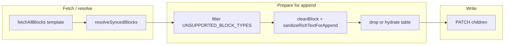

# fix — Copy-blocks append payload validation (mentions + tables)

## Overview

Provisioning copies Blueprint template bodies onto new Study Task pages via `PATCH /blocks/{page_id}/children`. Notion **rejects** payloads that mirror **read** responses for some nested shapes — notably **`rich_text` mentions** (e.g. `link_preview`) and **`table` blocks without `children`**. Today those shapes survive `cleanBlock` and cause **400 validation errors**; `copyBlocks` catches them, logs `copy_blocks_page_error`, and leaves production pages **blank** even though templates show content in Notion UI.

This plan hardens the append pipeline by **normalizing** rich text and **excluding or hydrating** composite blocks so append succeeds without silent total-page failure.

---

## Problem Frame

- **Symptom:** Production Study Tasks empty body; Blueprint sibling shows full text (Meg 2c Hard Lock cluster).
- **Root cause (verified):** Append-time Notion validation — not shallow column stripping alone. Shared synced body includes a paragraph whose `rich_text` contains a **`link_preview` mention**; other templates hit **`table.children` undefined**.
- **Actors:** Cascade Engine (Inception / Add Task Set → `copyBlocks`), Notion API append contract, Blueprint authors.

---

## Requirements Trace

- **R1.** Appending copied template content must not fail whole-page copy solely because of **`link_preview`** (and similarly unsupported) **`mention`** subtypes returned by the Blocks API.
- **R2.** Appending must not fail with **`table.children` undefined`** — either omit tables from the append batch or supply a structurally valid table payload.
- **R3.** Existing behaviors remain: synced_block resolution, unsupported **block-type** filtering, `MAX_BLOCKS_PER_APPEND`, token queueing, `copy_blocks_page_error` on genuine downstream failures.
- **R4.** Unit tests cover the new normalization paths using **mock block payloads** shaped like production API responses (no live Notion dependency in CI).

---

## Scope Boundaries

- **Terminology:** **Sanitize** means rewriting `rich_text` segment objects (e.g. unsupported `mention` → `text` / `link`). **Exclude** means omitting entire block types from the append payload (same family as `UNSUPPORTED_BLOCK_TYPES`).
- **In scope:** `src/provisioning/copy-blocks.js` normalization for append; companion tests in `test/provisioning/copy-blocks.test.js`.
- **Non-goals:** Changing Inception/add-task-set orchestration; widening supported block types beyond safe normalization; perfect WYSIWYG fidelity for every Notion block type.
- **Deferred to follow-up work:** Full **table fidelity** (reconstruct row/cell hierarchy from nested fetches) if PM wants tables copied verbatim rather than dropped or placeholder-handled.

**Table MVP (explicit):** Every **`table`** block is **omitted** from the append batch in this change — there is **no** partial or best-effort table copy until a follow-up hydrates rows/cells. Prod Study Task bodies may show prose around where a table sat in the Blueprint.

---

## Context & Research

### Relevant Code and Patterns

- **`cleanBlock` / `stripNullValues`:** Already fixes null icon / text→rich_text rename — extend with a dedicated **rich_text sanitization** pass for append.
- **`UNSUPPORTED_BLOCK_TYPES`:** Top-level `link_preview` blocks already filtered; **inline** mentions inside `paragraph` etc. are **not** filtered — separate code path required.
- **`prepareTemplateChildren`:** Single choke point before append (also used by `prefetchTemplateBlocks`) — any fix must apply **both** prefetched and lazy `processOnePage` paths (today both funnel through `cleanBlock` after resolve).

### Institutional Learnings

- No `docs/solutions/` hits for copy-blocks in this engagement workspace scan — rely on investigation evidence.

### External References

- Notion **Append block children** API: mention objects on **create** accept only certain `mention.type` shapes; **read** shapes like `link_preview` often **fail on write** — implementer should skim current Notion API docs for `rich_text` mention variants when implementing sanitization.

---

## Key Technical Decisions

- **D1 — Mention strategy:** Replace unsupported **`mention`** segments with **`text`** segments that preserve the URL (and optional plain-text label), matching patterns Notion accepts on append. Drop mentions only when no safe URL/text can be derived.
- **D2 — Table strategy (MVP):** **Exclude all `table` blocks** from the append payload (same class as “unsupported layout risk”) **and emit a structured console/tracer log** (e.g. `copy_blocks_skipped_block`) so operators see fidelity loss — avoids partial-page 400s. **Defer** full table hydration to follow-up unless PM elevates table copying as P0. Do **not** attempt “sanitize table” via U1; tables are **U2 exclusion only**.
- **D3 — Placement:** Implement sanitization as **`sanitizeRichTextForAppend`** invoked from **`cleanBlock`** (or immediately after per-type payload assembly) so prefetch + lazy paths stay unified.
- **D4 — Observability:** Optionally extend `copy_blocks_page_error` detail or add **warn-level** structured logs when sanitization or skips occur — keep noise low (counts per page optional stretch).

---

## Open Questions

### Resolved During Planning

- **Columns-only hypothesis:** Investigation refuted for Meg’s Hard Lock templates — synced source uses ordinary paragraphs with **`link_preview` mentions**; fix is append sanitization, not column recursion.

### Deferred to Implementation

- **Exact mention inventory:** Which mention types appear across **all** Blueprint templates — discover via sampling or prior Railway error corpus; extend sanitizer allow/deny list accordingly.
- **Chunked append beyond `MAX_BLOCKS_PER_APPEND`:** Today resolved children are **sliced** to the cap — templates with more top-level blocks silently lose tail content. Out of scope for this fix unless PM prioritizes pagination/multi-request append.

---

## High-Level Technical Design

> *This illustrates the intended approach and is directional guidance for review, not implementation specification. The implementing agent should treat it as context, not code to reproduce.*

---

## Implementation Units

- U1. **Rich-text mention sanitization for append**

**Goal:** Prevent 400s from **`mention.link_preview`** (and peers) embedded in `rich_text`.

**Requirements:** R1, R3, R4

**Dependencies:** None

**Files:**
- Modify: `src/provisioning/copy-blocks.js`
- Test: `test/provisioning/copy-blocks.test.js`

**Approach:**
- Add **`sanitizeRichTextForAppend(richTextArray)`** (exported **only if tests need it**, otherwise module-private) that walks each segment:
  - **`mention`** with unsupported type for append → convert to **`text`** with `link` when URL known; else plain content fallback.
  - Preserve **`text`** / **`equation`** / other segments that already append cleanly (add deny-list only where production proved failures).
- Invoke from **`cleanBlock`** for every type in **`RICH_TEXT_BLOCK_TYPES`** after `text`→`rich_text` normalization and before **`stripNullValues`** (order chosen so stripNull runs last).

**Patterns to follow:**
- Existing **`stripNullValues`** / **`cleanBlock`** structure; keep pure functions testable without Notion network.

**Test scenarios:**
- **Happy path:** Paragraph whose `rich_text` is only plain `text` segments → unchanged append payload.
- **Happy path:** Paragraph containing **`mention.link_preview`** with URL → append payload uses **`text`** (+ optional **`link`**) only; **no** `mention` object remains.
- **Edge case:** Mixed text + link_preview + trailing text → order preserved.
- **Edge case:** Mention shape with missing URL → sanitization drops or replaces with empty-safe fragment without throwing.
- **Regression:** Existing **`cleanBlock`** tests (`icon:null`, text rename) still pass.

**Verification:**
- Vitest green; manual optional: reproduce Hard Lock template append against sandbox page if PM provides slot.

---

- U2. **Table blocks — exclude from append batch (MVP)**

**Goal:** Eliminate **`table.children should be defined`** append failures.

**Requirements:** R2, R3, R4

**Dependencies:** U1 (ordering flexible — no hard dependency; land same PR)

**Files:**
- Modify: `src/provisioning/copy-blocks.js`
- Test: `test/provisioning/copy-blocks.test.js`

**Approach:**
- Treat **`table`** (and if surfaced as standalone **`table_row`** without parent context, exclude similarly) as **non-appendable** in **`prepareTemplateChildren`** alongside **`UNSUPPORTED_BLOCK_TYPES`**, **or** filter immediately before append after clean — prefer **one consistent filter site** with UNSUPPORTED set for reviewer clarity.
- Add **`table`** / **`table_row`** to the exclusion mechanism used for copy (document in comment why).
- Emit **`console.log(JSON.stringify({ event: 'copy_blocks_skipped_block', reason: 'table_requires_hydration', ... }))`** at **debug-style** volume: **per skipped block max once per template prepare**, not per row explosion — tune to avoid log storms on wide tables.

**Patterns to follow:**
- Mirror **`UNSUPPORTED_BLOCK_TYPES`** filtering semantics already tested in **`copyBlocks`** suite.

**Test scenarios:**
- **Happy path:** Template returns **`paragraph`** then **`table`** then **`paragraph`** → append payload contains **two paragraphs only**; **`pagesProcessed`** reflects successful append.
- **Edge case:** Template is **only** a table → page skipped or appended empty-only policy matches existing **`pagesSkipped`** semantics (document chosen behavior in test name).

**Verification:**
- Vitest asserts no **`table`** objects appear in PATCH body for fixtures; optional assertion that skip log fires once when tracer/console spy enabled.

---

- U3. **Docs touch-up (behavior reference)**

**Goal:** Future operators understand fidelity limits.

**Requirements:** R3 (operational clarity)

**Dependencies:** U1, U2

**Files:**
- Modify: `docs/ENGINE-BEHAVIOR-REFERENCE.md` (short subsection under provisioning / copy-blocks)

**Approach:**
- Document **mention flattening** and **table omission** as intentional provisioning constraints; link to this plan.

**Test expectation:** none — documentation only.

**Verification:**
- PM skim confirms wording matches Meg-facing narrative.

---

## System-Wide Impact

- **Interaction graph:** Only **`copyBlocks` / `prefetchTemplateBlocks`** consumers (`src/routes/inception.js`, `src/routes/add-task-set.js`, `src/routes/copy-blocks.js` webhook if present) inherit sanitized payloads — **no signature changes** required.
- **Error propagation:** Genuine Notion failures still surface as **`copy_blocks_page_error`**; fewer false negatives from validation noise.
- **Partial success / idempotency:** Copy remains **best-effort per page**: blocks appended before a downstream failure **stay** on the page; retries **may duplicate** content if the target was not cleared — unchanged behavior, but implementers must **not** assume all-or-nothing atomicity across multi-page runs.
- **Unchanged invariants:** **`MAX_BLOCKS_PER_APPEND`**, synced resolution depth, concurrency knobs.

---

## Risks & Dependencies

| Risk | Mitigation |
|------|------------|
| Over-sanitization removes valuable mentions | Preserve URL in text+link; enumerate types incrementally |
| Table omission surprises authors | ENGINE-BEHAVIOR-REFERENCE + optional structured skip logs |
| Unknown mention variants still 400 | Extend sanitizer after sampling Railway / Blueprint corpus |
| Templates with more than `MAX_BLOCKS_PER_APPEND` top-level blocks lose tail silently | Document in behavior reference; defer chunked append unless PM prioritizes |

---

## Documentation / Operational Notes

- After ship: spot-check **Meg Hard Lock** templates in sandbox study — bodies should populate with prose; URLs appear as links instead of preview mentions.
- Monitor Railway for **`copy_blocks_page_error`** rate drop post-deploy.

---

## Sources & References

- Investigation conclusions: Meg 2c pulse deliverable **004** (append validation root cause; Railway excerpts) — maintained outside engine repo by engagement PM.
- Code: `src/provisioning/copy-blocks.js`, `test/provisioning/copy-blocks.test.js`
- Prior planning context: `docs/plans/2026-04-29-001-fix-meg-apr29-feedback-investigation-plan.md` (investigation-track items — superseded screenshot gate per Meg)

**ID disambiguation:** Meg-facing investigation threads may label workstreams **“U3”** for traceability; **implementation unit U3** in *this* document is **documentation only** (`ENGINE-BEHAVIOR-REFERENCE`). When linking from Slack/pulse, cite **plan filename + unit label** to avoid cross-thread collisions.

---

## Document review (ce-doc-review pass — 2026-04-29)

Integrated findings:

- **Coherence:** Clarified **sanitize vs exclude**, **all tables omitted** for MVP (no partial table via U1), and **U3** naming collision vs investigation trackers (see Sources).
- **Feasibility:** Confirmed top-level `link_preview` in `UNSUPPORTED_BLOCK_TYPES` does **not** fix inline `mention.link_preview` — U1 must walk **`rich_text`** after synced resolution on **both** prefetch and lazy paths. Recorded **partial-append / retry duplication** expectations and **`MAX_BLOCKS_PER_APPEND`** silent truncation as existing limitation (deferred unless prioritized).
